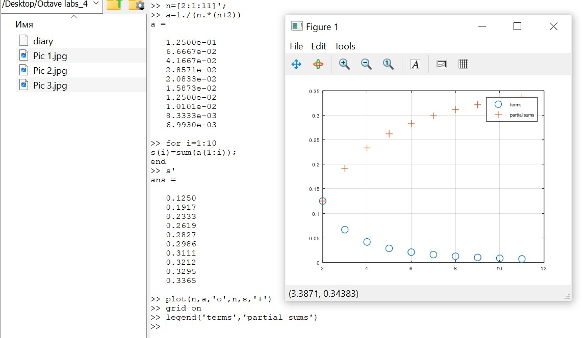

---
## Front matter
lang: ru-RU
title: Лабораторная работа №6
subtitle: Научное программирование
author:
  - Таубер Кирилл Олегович
institute:
  - Российский университет дружбы народов
  - Москва, Россия
date: 3 февраля 2024

## i18n babel
babel-lang: russian
babel-otherlangs: english

## Formatting
mainfont: PT Serif
romanfont: PT Serif
sansfont: PT Sans
monofont: PT Mono
toc: false
slide_level: 2
theme: metropolis
header-includes: 
 - \metroset{progressbar=frametitle,sectionpage=progressbar,numbering=fraction}
 - '\makeatletter'
 - '\beamer@ignorenonframefalse'
 - '\makeatother'
aspectratio: 43
section-titles: true
---

## Цель лабораторной работы

Изучить в Octave методы расчета пределов, частичных сумм, суммы ряда, а также методы вычисления интегралов и аппроксимирования суммами

## Теоретическое введение

__Анонимная функция__ - особый вид функций, которые объявляются в месте использования и не получают уникального идентификатора для доступа к ним. Обычно при создании анонимные функции либо вызываются напрямую, либо ссылка на функцию присваивается переменной, с помощью которой затем можно косвенно вызывать данную функцию. 

В Octave aнонимные функции определяются с помощью синтаксиса 

@(argument-list) expression.

Любые переменные, которые не найдены в списке аргументов, наследованы от объема включения. Анонимные функции полезны для создания простых функций без имени от выражений или для обертывания вызовов к другим функциям для адаптации их к использованию функциями как quad, которая применяется при вычислении интегралов.

## Ход выполнения лабораторной работы
- Оценили предел: $\lim\limits_{n\to \infty} {(1+\frac{1}{n})}^{n}$ 

- Полученный результат близок к теоретическому значению предела - $e$

{ #fig:001 width=60% }

## Ход выполнения лабораторной работы
- Пусть $\sum_{n=2}^{\infty}$ ${a_n}$ - ряд, n-й член равен $a_n=\frac{1}{n(n+2)}$. Построили слагаемые и частичные суммы для $2 \le n \le 11$ на графике

{ #fig:003 width=70% }

## Ход выполнения лабораторной работы
- Нашли сумму первых 1000 членов гармонического ряда: $\sum_{n=1}^{1000} \frac{1}{n}$

{ #fig:004 width=15% }

- Вычислили интеграл: $\int\limits_0^\frac{\pi}{2} e^{x^2}cos(x) dx$

{ #fig:005 width=40% }

## Ход выполнения лабораторной работы
- Вычислили указанный ранее интеграл по правилу средней точки для n=100 (классический код)

{ #fig:007 width=50% }

## Ход выполнения лабораторной работы

- Вычислили указанный ранее интеграл по правилу средней точки для n=100 (векторизованный код)

{ #fig:008 width=60% }

## Ход выполнения лабораторной работы

- Сравнивнили результаты и время выполнения программ

{ #fig:010 width=80% }

## Вывод
- В ходе выполнения данной лабораторной работы я изучил в Octave методы расчета пределов, частичных сумм, суммы ряда, а также методы вычисления интегралов и аппроксимирования суммами
