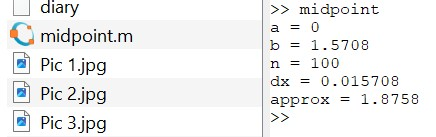

---
## Front matter
title: "Лабораторная работа №6"
subtitle: "Научное программирование"
author: "Таубер Кирилл Олегович"

## Generic otions
lang: ru-RU
toc-title: "Содержание"

## Bibliography
bibliography: bib/cite.bib
csl: pandoc/csl/gost-r-7-0-5-2008-numeric.csl

## Pdf output format
toc: true # Table of contents
toc-depth: 2
lof: true # List of figures
fontsize: 12pt
linestretch: 1.5
papersize: a4
documentclass: scrreprt
## I18n polyglossia
polyglossia-lang:
  name: russian
  options:
	- spelling=modern
	- babelshorthands=true
polyglossia-otherlangs:
  name: english
## I18n babel
babel-lang: russian
babel-otherlangs: english
## Fonts
mainfont: PT Serif
romanfont: PT Serif
sansfont: PT Sans
monofont: PT Mono
mainfontoptions: Ligatures=TeX
romanfontoptions: Ligatures=TeX
sansfontoptions: Ligatures=TeX,Scale=MatchLowercase
monofontoptions: Scale=MatchLowercase,Scale=0.9
## Biblatex
biblatex: true
biblio-style: "gost-numeric"
biblatexoptions:
  - parentracker=true
  - backend=biber
  - hyperref=auto
  - language=auto
  - autolang=other*
  - citestyle=gost-numeric
## Pandoc-crossref LaTeX customization
figureTitle: "Рис."
tableTitle: "Таблица"
listingTitle: "Листинг"
lofTitle: "Список иллюстраций"
lolTitle: "Листинги"
## Misc options
indent: true
header-includes:
  - \usepackage{indentfirst}
  - \usepackage{float} # keep figures where there are in the text
  - \floatplacement{figure}{H} # keep figures where there are in the text
---

# Цель работы

Изучить в Octave методы расчета пределов, частичных сумм, суммы ряда, а также методы вычисления интегралов и аппроксимирования суммами.

# Теоретическое введение

__Анонимная функция__ - особый вид функций, которые объявляются в месте использования и не получают уникального идентификатора для доступа к ним. Обычно при создании анонимные функции либо вызываются напрямую, либо ссылка на функцию присваивается переменной, с помощью которой затем можно косвенно вызывать данную функцию. 

В Octave aнонимные функции определяются с помощью синтаксиса @(argument-list) expression. Любые переменные, которые не найдены в списке аргументов, наследованы от объема включения. Анонимные функции полезны для создания простых функций без имени от выражений или для обертывания вызовов к другим функциям для адаптации их к использованию функциями как quad, которая применяется при вычислении интегралов.

Более подробно см. в [@Octave_1:bash] и [@Octave_2:bash].

# Выполнение лабораторной работы

Рассмотрим предел:

$$\lim\limits_{n\to \infty} {(1+\frac{1}{n})}^{n}$$

Оценим данное выражение. Для этого определим функцию с помощью метода анонимной функции. Создадим также индексную переменную, состоящую из целых чисел от 0 до 9. Возьмем степени 10, которые будут входными значениями, а затем оценим $f(n)$ (рис. @fig:001) и (рис. @fig:002).

{#fig:001 width=80%}

{#fig:002 width=80%}

Полученный результат близок к теоретическому значению предела - $e$.

Пусть $\sum_{n=2}^{\infty}$ ${a_n}$ - ряд, n-й член равен $a_n=\frac{1}{n(n+2)}$. Определим индексный вектор n от 2 до 11 и вычислим члены. Для получения последовательности частичных сумм используем цикл и функцию sum(a). На выходе получаем 10-элементный вектор частичных сумм. Строим слагаемые и частичные суммы для $2 \le n \le 11$ на графике (рис. @fig:003).

{#fig:003 width=110%}

Найдем сумму первых 1000 членов гармонического ряда (рис. @fig:004): $$\sum_{n=1}^{1000} \frac{1}{n}$$.

{#fig:004 width=40%}

Вычислим интеграл (рис. @fig:005): $$\int\limits_0^\frac{\pi}{2} e^{x^2}cos(x) dx$$.

{#fig:005 width=80%}

Пишем код, чтобы вычислить указанный ранее интеграл по правилу средней точки для n=100: используем цикл, который добавляет значение функции к промежуточной сумме с каждой итерацией, а в конце сумму умножаем на $\Delta x$ (рис. @fig:006) и (рис. @fig:007).

{#fig:006 width=80%}

{#fig:007 width=60%}

Напишем векторизованный код. Создадим вектор x-координат средних точек, далее оцениваем f по этому вектору средней точки, чтобы получить вектор значений функции. Аппроксимация средней точки - это сумма компонент вектора, умноженная на $\Delta x$ (рис. @fig:008) и (рис. @fig:009).

{#fig:008 width=80%}

{#fig:009 width=60%}

Полученные результаты совпадают с предыдущими. Сравним время выполнения для каждой реализации. Получили, что векторизованный код более эффективен по времени, чем традиционный (рис. @fig:010).

{#fig:010 width=80%}

# Вывод 

В ходе выполнения данной лабораторной работы я изучил в Octave методы расчета пределов, частичных сумм, суммы ряда, а также методы вычисления интегралов и аппроксимирования суммами.
